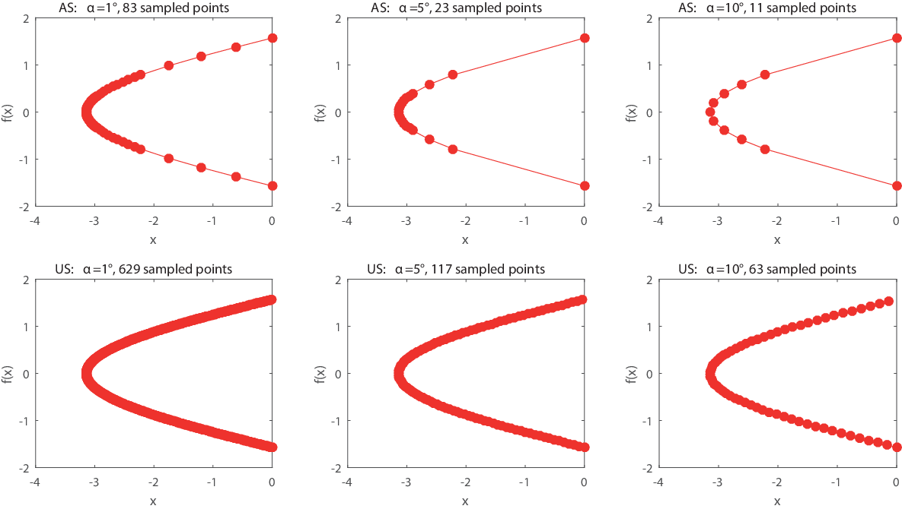
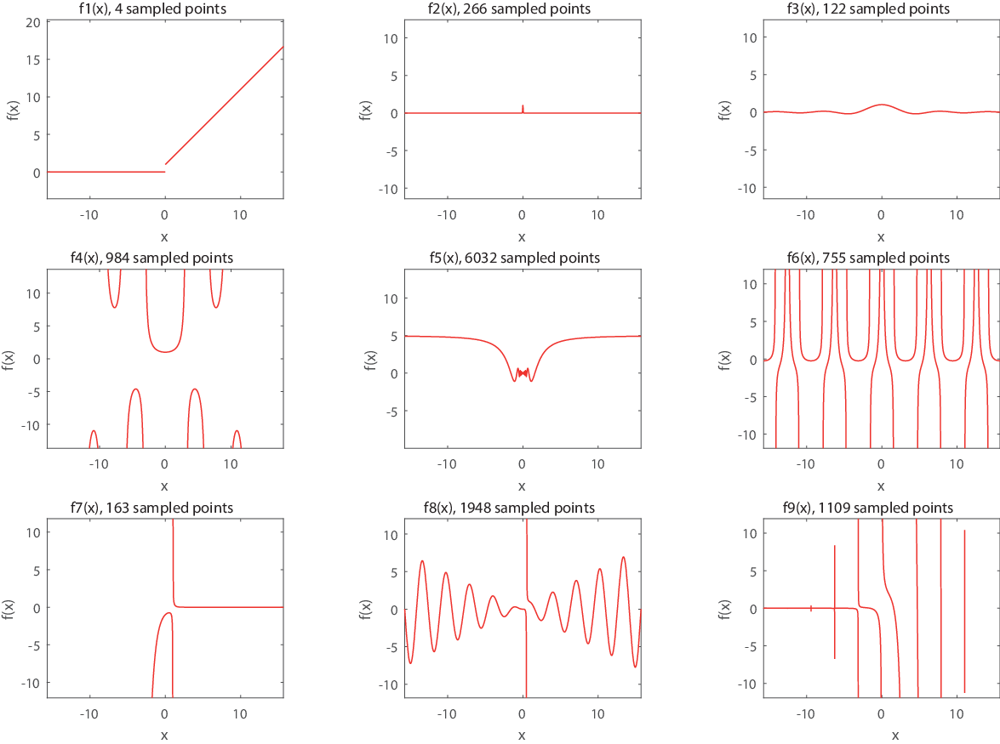

## Efficient plotting of functions with discontinuities based on combined sampling

New algorithm for interval plotting of the function y = f(x) based on the combined sampling. The proposed method synthesizes uniform and adaptive csampling approaches and provides a more compat and efficient function representation. 

During the combined sampling, the polygonal approximation with a given threshold - between adjacent segments is constructed. The automated detection and treatment of discontinuities based on LR criterion are involved. 

Two implementations, the recursive-based and stack-based, are introduced. Finally, several tests of the proposed algorithms for different functions involving discontinuities and several map projection graticules are presented. The proposed method may be applied in geoinformatic for more efficient sampling the curves (map projection graticules, contour lines, or buffers). 

